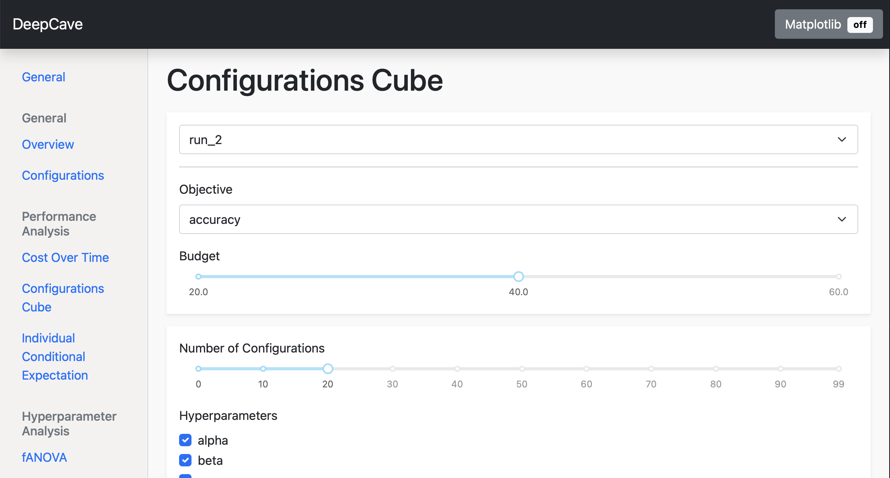

# DeepCAVE

DeepCAVE has two main contributions:
- Recording runs and
- Visualizing and evaluating trials of a run to get better insights into the AutoML process.


## Installation

First, make sure you have
[swig](https://www.dev2qa.com/how-to-install-swig-on-macos-linux-and-windows/) installed on your
computer. Afterwards, follow the instructions:

```
git clone https://github.com/automl/DeepCAVE.git
cd DeepCAVE
conda create -n DeepCAVE python=3.9
pip install .
```

If you want to use DeepCAVE in a different directory set your PYTHONPATH:
```
export PYTHONPATH=$(pwd)
```


## Recording

In the following, a minimal example is given to show the simplicity yet powerful API to record runs.

```
import ConfigSpace as CS
from deep_cave import Recorder, Objective


configspace = CS.ConfigurationSpace(seed=0)
alpha = CS.hyperparameters.UniformFloatHyperparameter(
    name='alpha', lower=0, upper=1)
configspace.add_hyperparameter(alpha)

accuracy = Objective("accuracy", lower=0, upper=1, optimize="upper")
mse = Objective("mse", lower=0)

with Recorder(configspace, objectives=[accuracy, mse]) as r:
    for config in configspace.sample_configuration(100):
        for budget in [20, 40, 60]:
            r.start(config, budget)
            # Your code goes here
            r.end(costs=[0.5, 0.5])
````


## Visualizing and Evaluating

The webserver as well as the queue/workers can be started by running ``` ./run.sh ```. 
Visit `http://127.0.0.1:8050/` to get started.



