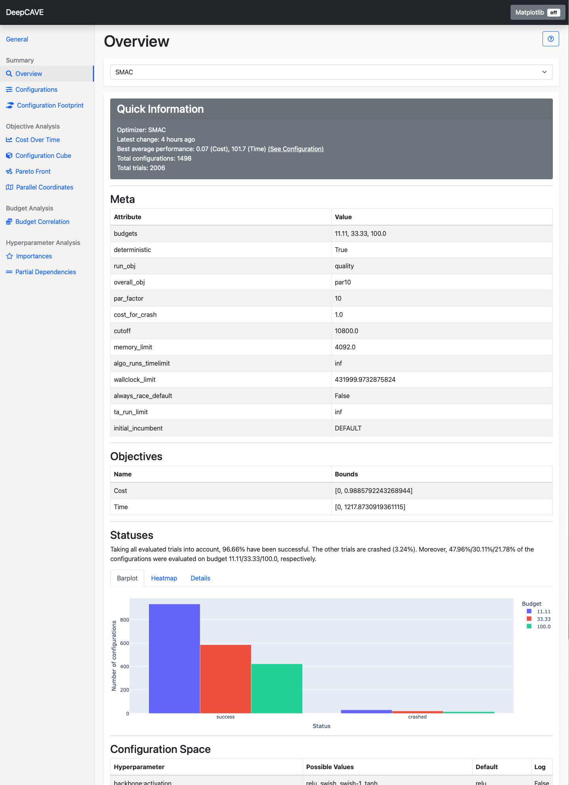

# Overview
The plugin overview is a perfect way to see the most important information about
your selected runs. This plugin serves as sanity check and therefore let's you know
about the meta data, objectives and statistics of the selected run.

The Overview is split into 5 parts:
- Quick Information
- Meta
- Objectives
- Statuses
- Configuration Space

This plugin is capable of answering following questions:
- Which optimizer was used?
- When was the latest change of the optimizer's data?
- What is the best configuration?
- Are the meta data as expected?
- Are the objectives as expected?
- Is the configuration space as expected?
- How many trials have been successful/unsuccessful?
- Why did certain trials crash?
- On which budgets were the configurations evaluated?

#### Quick Information
In the **Quick Information** box you'll information regarding summary statistics about your run or group of runs. Notably information on the optimizer used, how many configurations were tried, when the runs were last updated and a handy quick link to the best **Configuration**.

#### Meta
Next we show some meta information regarding your runs. Notably, you can see information such as the possible **budget** allocations that were considered during the run.

#### Objectives
In this section, we see the objectives that were considered during the optimization run. Here we get information about it's name and the bounds they were in.

#### Statuses
To get a nice overview of the optimization run, we provide a barplot that details how the end status of the many trials that occured. You can also view these as a heatmap or get more information from the **Details** tab.

The barplot shows which trial recieved which status and under which budget allocation. These are grouped according to the status and coloured based on the status it exited with.

To see details on how these configurations faired as they progressed in budget, you can refer to the **Heatmap** tab. Here you'll see the budget allocation along the x-axis with the configuration ID stacked on the y-axis. In an ideal scenario, you would see mostly **Success** bars spanning across the entire plot, with some **NOT_EVALUATED** lines indicating there is further configurations to try. However if you faced many crashes at high budgets for example, you'll see **CRASHED** bars from the highest budget onwards. In general, you can use this to understand how often your optimizer balances out between low budget evaluations and full budget evaluations.

In the **Details** tab, you'll recieve an overview of configurations that were not successful. Here you'll get some breif information about the config id number, the budget it was evaluated under and the status it recieved. If there is an associated error we can provide, such as when it recieved the **CRASHED** status, we will display it in the error column.

#### Configuration Space
Lastly you can find information on the configuration space that was being optimized over. Here we provide information on it's name, the possible values that could be tried as well as the default value and whether it was optimized on a log-scale vs a linear one.

